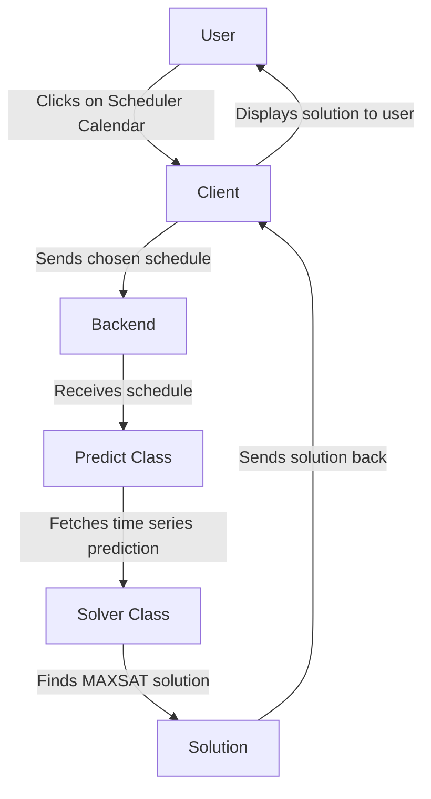

# workout-app
Simple workout scheduler built for the course "Introduction to Data Science" in University of Helsinki.

## Problem description
The user wants to schedule $n$ workouts a given timeframe of available timeslots, i.e., starting date and hour of a workout. Given historical observations of the "crowdedness" under some metric (e.g., number of people arrived in a gym), how should the user choose the workout times in order to avoid the busy time slots? Other factors can also be taken in account in the preferences of the user, like the distance to the workout location and so on.

## Approach to solution
Given predictions as time series, form predictions for future values of "crowdnedness". This leads to a combinatorial problem, where the 
user wants to find to the optimal time slots to minimize total "crowdedness" while meeting the constraint of total required number of workouts. 
We model this binary optimization problem as a weighted `MAX-SAT` problem, which can be solved using existing Python libraries, such as [PySAT](https://pysathq.github.io).

## Scheduler workflow


## Setting up the environment
Install dependencies and start backend in `./backend`
```
poetry install
poetry run python app.py &
```

Install dependencies and start frontend in `./frontend`
```
npm install && npm run dev &
```

